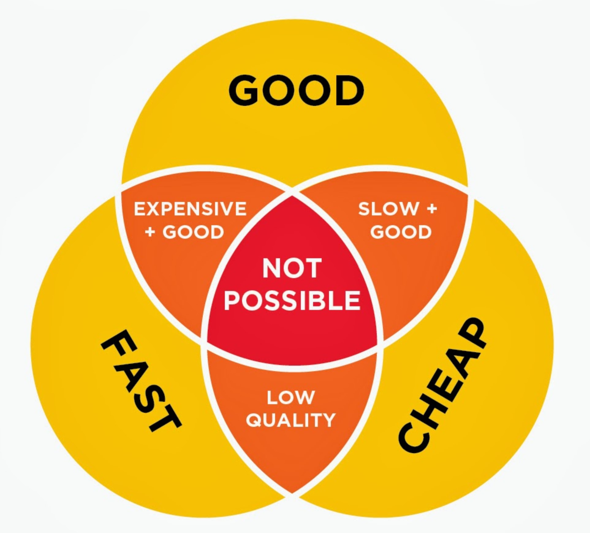
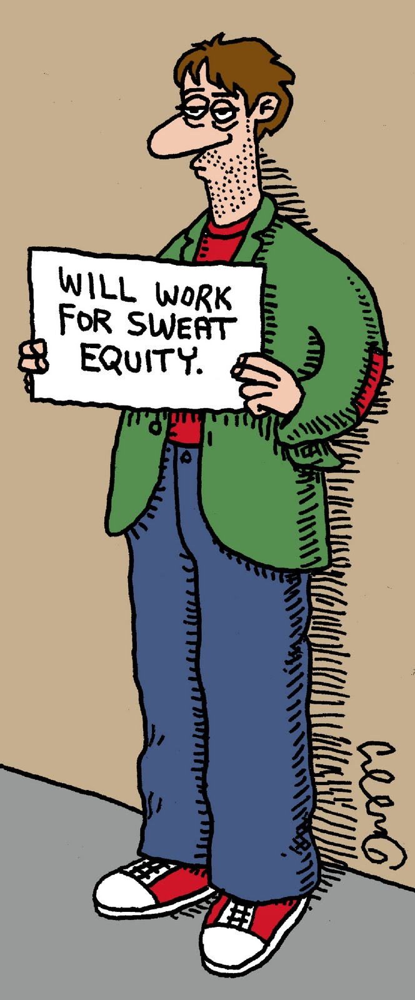

_"Mirror mirror, on the wall, who is the fairest of them all ?"_

Contents

1. Example project funding of Interblock
1. Example project funding of DOS

Ambient Attribution

Software companies make up trillions of dollars on the stockmarket, but
the best quality software is actually free - how can we connect these two extremes
to something more sustainable, and how can we get more software, of a higher quality,
faster, and cost lest money ?

Based on two forces:

1. fair credit due everywhere
1. zero friction for reuse

These qualities change the bigger the pool gets
[graphic of pool size vs ideal match]
Biggest pool is the lowest friction
quality largely depends on the people you have available.
let us assume their is an optimal piece of work, at an optimal price.
the more people can do the work the better.
less friction, zero friction company.
zero liability, zero friction, never credit.
credit being given by the worker, acting as a bank.
[graph showing decreasing overall cost]

Work for sweat 

decreasing activation cost
longer it survives, the better the quality
a good programmer on their day
public scrutiny, even if perceived
can be called to account years after your coding

how much reward is fair ?
surmise there is a single fair answer.
self witness, shared witness, unto others as they unto you, wisdom of crowds
image should be the same looking back, no different.
how they see you should be same as how you see them.
this is shared vision - aka reality.
fairness is something that looks the same from all sides

What is fair payment ?
Depend on each situation.
Depends on the utility gained.

## Example: Funding Interblock

What is the prize ?

### What is the product ?

Equity stake in the upside.
Consumers of the product are politly asked for fair payment

Types of input:

1. Direct funds used by project command
1. Code contribution
1. Direct funded code contribution
1. Early customer

We hope these models of labour, if successful, can have equivalents in the physical product world.

## Restrictions on investment

Any projects that we endorse must follow the following rules, which are automated:

1. Investors must prove they know what the project is about
1. Investors must be able to afford to lose their investment
1. Projects must have an earnest goal

We are unable to register many of our projects with the SEC due to our requirements to stay anonymous. However we support the spirit of the SEC regulations, and we aim to exceed their intention.

To invest in a software project, you must have made a code commit of more than x weighted value, which signals that you know what the project is about, and you have contributed enough to be part of the enterprise - a worker, as it were - relying on the efforts of others and yourself to show return.
