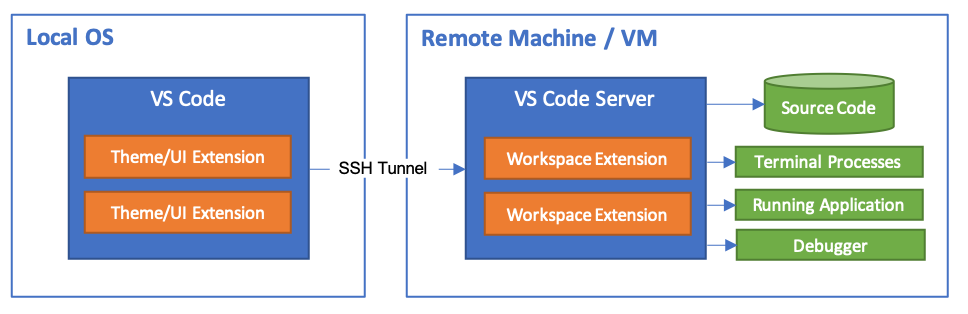

_“It’s only funny until someone loses an identity”_

**Contents**

1. [Coding Under Threat](#coding-under-threat)
1. [Value of anonymous code production](#value-of-anonymous-code-production)
1. [Goals of an Operating Model](#goals-of-an-operating-model)
1. [Actors in the model](actors-in-the-model)
1. [Threat Types](#threat-types)
1. [Required Items and Tooling](#required-items-and-tooling)
1. [Architecture](#architecture)
1. [Getting a burner number](getting-a-burner-number)
1. [Importing existing code](importing-existing-code)
1. [Workstation Procedure](#workstation-procedure)
1. [AWS Procedure](#aws-procedure)
1. [Pitfalls](#pitfalls)
1. [Accessing the Aragon DAO](#accessing-the-aragon-dao)
1. [Deniability](#deniability)
1. [Bastions](#bastions)
1. [Cashing out to fiat](#cashing-out-to-fiat)
1. [Shutting Down](#shutting-down)
1. [Contributing to this Article](#contributing-to-this-article)

## Coding Under Threat

Deployed software must endure various threats during its operating life, but
seldom is the threat to the coding operation itself considered. We think often
about the security of our applications, but not so often about the security of
ourselves. The ability to keep coding is foundational to every project. Project
endurance can be damaged by many things, and maintaining a basic level of
anonymity provides a very low cost way to handle many common endurance attacks.

For reference, the Four freedoms of open source software are:

1. The freedom to run the program as you wish, for any purpose.
1. The freedom to study how the program works, and change it so it does your
   computing as you wish.
1. The freedom to redistribute copies so you can help your neighbor.
1. The freedom to distribute copies of your modified versions to others.

Adhering to these freedoms, one can rapidly come under code production threat if
established closed source corporations need to defend themselves in some way.
This post deals with the specific case of making open source software, with
transparent operations, detached from any identifying information about the
contributors.

## Value of anonymous code production:

1. For Growth: Anonymous contribution makes it hard to intermingle opinions
   about the authors from a particular idea or embodiment, allowing a purer form
   of discourse and evaluation to take place. There can be no discrimination of
   contributions if the people making them do not know who each other are.

1. For Safety: Getting sued is time wasting and also costly. Worse, any
   unresolved court cases will stunt growth as people await the outcome, or are
   scared off by bullying tactics of attackers. As global activity spreads, the
   chances of falling afoul of some regulation somewhere approaches certainty,
   with the only true protection being anonymity.

1. For maximizing investment: No lawyers fees, no company filings, no
   administrative costs whatsoever

1. For Resilience: After being completely burned, one person should be able to
   reboot the project in a matter of days with only the core keys. This should
   be possible in the face of censorship, intrusion, or even benign hardware
   faults

## Goals of an Operating Model

Our model is based on a theoretical project operator, called Command, that
represents the virtualized interests of the driving group behind the project. In
this model Command is the identity to be protected above all else - like the
king in a chess game. Command is a stable identity, as opposed to transient, and
relies on the accumulation of reputation to enhance promotion and recruitment to
the project. The goals of this model are:

1. To be able to recreate any identity, and prove previous contribution, with
   just the key material
1. Cannot be possible to accidentally attempt to push to cloud with the wrong
   identities or credentials
1. Tor gateway shutdown results in no possible pushes to github
1. Be more resistant to human error than a vpn
1. Friendly developer experience
1. Rapidly reprovisionable development environment

## Actors in the model

1. Command
1. Contributors
1. Operators
1. Users
1. Investors
1. Promoters

## Threat Types

Things you might want to be protected from:

- greed (your own, and others around you)
- costly fights
- reputational harm
- project reputational harm
- government
- tax
- piracy
- unpopularity
- discimination
- DMCA takedown
- Patent infringement
- Tax Collectors
- Securities commissions across the world
- Peers
- Civil lawsuits - those originating from private individuals and companies.
- Law Enforcement
- Violence / War
- Govt raid or wiretap
- Services subpoena - Github - Aws - Protonmail - Serverless.com
- Service terms (eg: AWS decides you are unwelcome)
- Malware compromise
- Enthusiast investigation
- Friends and family exposure
- Employer exposure
- DDoS

Typically correlation is done using IP addresses, credit cards, and cell phone
sim cards. These are crucial pieces of identity to secure anonymously.

## Required Items and Tooling

Traceable items needed:

1. Ether cryptocurrency - about $150USD worth
1. Bare metal machine with a trusted environment - eg: a fresh install

Cloud services used:

1. Github private repos
1. Protonmail
1. Mega for cloud backup

Key material kept on:

1. Keepass GPG keys per identity

## Architecture

We are using the Whonix workstation in conjunction with VSCode ssh tunneling to
have the richness of VSCode development, the speed of a local development
environment, as well as obfuscation of IP addresses by tunneling thru TOR. This
is how Whonix guarantees nothing can escape the workstation VM:


This is how we can use VSCode on our local machine while running the development
environment within the Whonix protective ring:



All browsing needs to be done with the TOR browser

## Getting a burner number

First you need anonymous money. Send the ETH to the mixer at
[Tornado.cash](https://medium.com/@tornado.cash/introducing-private-transactions-on-ethereum-now-42ee915babe0).
Then use the output funds to purchase a temporary cell phone number from
[crypton.sh](http://cryptonx6nsmspsnpicuihgmbbz3qvro4na35od3eht4vojdo7glm6yd.onion/).
Use some more of the money to purchase an anonymous credit card from
[Ezzo](https://ezzocard.com/how-to-pay) - this will be needed to host on AWS.

## Importing existing code

If bringing in an existing codebase, make sure it comes in mangled so that the
initial commit does not simply map to the last commit of some other repository.
To trace attribution, make sure you reference some kind of git tree somewhere,
and probably sign something in there. Then you want to get it snapshotted on
archive.org and a bunch of other places so it is versioned correctly. Ideally it
would automatically peg to the btc blockchain, but we aren’t quite there yet….

## Workstation Procedure

1. Ensure bare metal OS is free from any credentials related to any services or
   compromise, preferably with reinstall
1. Install base OS software:

   1. virtualbox, keepass, putty, vscode, torbrowser

1. Create name for identitiy, and create protonmail and github accounts
   1. Use TOR to access namegen webpages such as
      https://randomnames.herokuapp.com/# in order to get a completely random
      name. Or you could just make one up...
   1. Set up a protonmail account, and use the burner number as verification, or
      pay the $5USD donation fee if you purchased a burner credit card.
   1. Set up a github account using this email account.
   1. Github captcha may require about:config in the Firefox address bar and
      find security.csp.enable and set it to false, and or use the audio captcha
      at signin, or else you can't use the tor browser to create the account
1. Install whonix workstation cli version from
   https://www.whonix.org/wiki/VirtualBox/CLI
1. Add a second host only adapter to the workstation vm
1. Install software on whonix workstation:
   `sudo apt install git openssh-server unzip oathtool`
1. Edit file: /etc/whonix_firewall.d/50_user.conf by adding the line:
   `EXTERNAL_OPEN_PORTS+=" 22 "`
1. Change the base user password
1. Add following lines to /etc/network/interfaces.d/30_non-qubes-whonix
   ```
   auto eth1
   iface eth1 inet static
       address 192.168.56.101
       netmask 255.255.255.0
   ```
1. Create user account with same name as the fake identity
1. Follow instructions to set up ssh based editing in vscode:
   https://code.visualstudio.com/docs/remote/ssh-tutorial
1. Set up node with this command:

   ```
   export SHELL=bash
   curl -fsSL https://github.com/Schniz/fnm/raw/master/.ci/install.sh | bash
   ```

1. Create ssh key and add to github
1. Create gpg key for signing commits, and add to github
   1. `gpg --full-generate-key --expert` (then choose ECC and ECC, then curve
      25519, as this makes shorter signatures)
   1. Config git using
      https://docs.github.com/en/github/authenticating-to-github/managing-commit-signature-verification
   1. `git config --global commit.gpgsign true`
1. Save the gpg private key and ssh private key in string fields in keepass
   1. `gpg --export-secret-key --armor`
   1. `cat ~/.ssh/id_rsa`
1. Set up 2FA on github and install oathtool:
   ```
   sudo apt install oathtool
   oathtool -b --totp (code from github)
   ```
1. use visudo to add give all dev group members ability to run whonixcheck:
   ```
   %dev    ALL=NOPASSWD:/usr/bin/whonixcheck
   ```
1. To access https://client.aragon.org in the TOR browser, open about:config and
   turn off "privacy.resistFingerprinting" - be sure to turn it back on again
   when not using aragon. An issue has been filed for this problem:
   https://github.com/aragon/client/issues/1529
1. Set an offensive color theme on torbrowser, so it is immediately clear when
   it is in use. Try not to use regular browser as this can lead to correlation
   with you IP and identity

### AWS Procedure

TODO

## Pitfalls

1. Urls in keepass accounts that when double clicked open protected urls in
   browser
1. Linked cloud accounts, that if one cloud service is accessed on clearnet,
   other might be able to trace back
1. Dev projects might try to make data requests out to other sites - none of our
   sites should ever request anything from outside the current realm
1. Vscode might follow links in code base - turn this off by disabling any kind
   of vscode link detection in user wide settings
1. opened cloud anonymous account url in clearnet after clicking on url in
   keepass and having it open automatically in chrome, not behind tor
1. Generating information inside the project that can be correlated somehow.
1. Credit card acquisition
   1. Paying with electronic means
   1. Paying with unwashed crypto
   1. Paying with cash from a bank or foreign exchange branch
   1. Cameras on the purchase spot
   1. Number plate from cameras on purchase spot
   1. Google location tracking on phone during purchase
   1. Recognized by shop merchant
   1. Using card too soon after acquisition
   1. Recommended best practice:
      1. Purchase something from a bakery to break the cash
      1. Use small shops away from city centres
      1. Wear sunglasses, a hood, a mask
      1. Turn off phone before entering
      1. Buy local, but not somewhere frequent, so being in the area isn’t
         correlated
1. Identity correlation
   1. Entering password for another account in relation to another account
   1. Accessing a rare page on clearnet, then same page shortly after on tor
   1. Accessing a rare page signed in as a github user, then visiting same page
      signed in as protected identity over tor
   1. Generating info, like pictures, or names, then using that info in projects
1. Plugins for tooling - anything that sends telemetry back to some owner
   1. License key information for tooling can be identifying Leaks from
      handwriting - use a diagramming tool like mermaid

### Accessing the Aragon DAO

The DAO is available at https://client.aragon.org/#/dreamcatchertech/

Using TOR browser with metamask extension installed. Cleanest way since wallet
is entirely self sovereign, however the extension does introduce some risk to
anonymity. The extension should be disabled when not in use on Aragon, and a new
Tor identity used whenever it is enabled or disabled. From checking the network
activity in the developer tools for the extension, its normal operations all go
thru TOR.

For those mostconcerned, we recommend running the browser inside a
whonixWorkstation, or compiling the extension from source on github. Worst case
a leak will be made to metamask or their services such as infura that maps your
eth address to your ip address. This does not compromise anonymity as a
producer, but might be undesirable as a funder. Activity in the extension can be
traced using
`about:devtools-toolbox?type=extension&id=webextension%40metamask.io` in the url
box.

This extension can read every webpage you go to, so only go to the aragon client
when it is activated. If the tor process is terminated, the metamask extension
cannot access infura, showing that it was fetching over tor. Opt out of any
telemetry requests.

Money routing cost comparison:

- binance > ETH > tornado > metamask swap > DAI Cost of transfer: $50USD tornado
  contract gas, but could probably get it for 10USD withdrawl from tornado
  60USD, cheapest is 24USD
- binance > DAI > tornado > DAI Cost of transfer: 50USD tornado contract gas
  withdraw gas fee $3.77

Sending in ETH is better since lets amounts up to 50kUSD go thru, and has more
traffic in the anonymity set. Downside is the price of ETH changing while the
funds are waiting

## Deniability

Always have layered reasons for how you came across any data you might get
questioned over. The best way is publishing blogs and projects as soon as
possible, spreading these ideas as far as possible.

Make info as public as possible with as much traffic on it as possible. Follow a
standard with other people following similar goals. The only secrets should be
key material.

It is never about being completely anonymous - its just about not being the
biggest fish in the anonymity pond so to speak. For example if the cash mixer
service you use is compromised by some state level actor, they won't really want
it known that they can compromise it, since they're looking for something
serious like a terrorist or war criminal. If all you're trying to do is write
software without getting judged for who you are as a human, they are very
unlikely to share the information about you with anyone.

## Bastions

Techniques The key to anonymity is looking the same as a whole lot of other
people. To that end, broadcasting as much information as you can, and following
a rigorous set of protocols makes you look the same as anyone else following the
plan. We begin by broadcasting our methods to a public blog platform dev.to in
order to plausibly say where our info came from

This is all part of our drive towards creating [zero liability companies](dev.to
link), which thru transparency and the higher hosting context of public
blockchains, can have higher trust levels, greater thruput, more direct service,
at lower costs.

Now ideally all this procedure would be hard baked in to the protocol, but since
this does not yet exist, we have to use discipline and technique to achieve
similar end goals.

https://github.blog/2020-02-20-2019-transparency-report/

Github allows pulling code anonymously, so rely on publication of your repo url,
the clone with collaborators thru tor

Bastions are isolated networks of operation. There is no cross over between
these networks, and no knowledge inside each one of any others. Any bastion
breach should not affect any other in any way. They all draw on a common
codebase, from the Core. This allows running each corporate venture on an
entirely isolated set of infrastructure.

Bastions allow projects to be built atop a potentially swappable blockchain
core. The swappability is important should legality force cessation of any
particular blockchain, and also to allow migration to the most suitable
blockchain, as they become available

Bastion 0: Core Bastion 1: CRM Allowed to use for commercial demonstrations
locally Bastion 2: Commercial demos Bastion N: any endeavours that need
isolation

Each bastion must have completely separate identity and infrastructure to the
others, and have no contact. Code sharing must be done offline. Only danger is
going to anon github urls while logged in to github, which only matters if
github gets breached, and should be covered by publicizing the urls.

https://ssd.eff.org/en/module/your-security-plan

Keep the infrastructure hidden - the worst thing that could happen is your site
is offline - this is a loss of a potential user, supporter, contributor, or
investor. [Uptime under duress](link to dev.to article) is hard

No bastion identities can come in contact with any others. If they need to share
code it needs to be via offline means. Leakage from one browsing anothers github
repos while logged in is only damaging if github is breached. Always protect the
infrastructure.

Sharing libraries between bastions:

1. nominate one user as the library owner
1. in each repo, stored in their home dir, chmod .git 700 so that no accidental
   commits can be made by any other user, leaking the relationship between users
1. make a group shared between the dev accounts called 'dev'

## Cashing out to fiat

For the best price and trust, use an exchange like binance.com but be aware you
will need to pass KYC verification. If you need to cash out anonymously, then
the best way to do that is using local based exchanges. These exchanges help you
conduct trades with people individually. For example, selling BTC, DAI, or ETH
to a local user results in about 1% below market loss, but will take about 15
minutes for the funds to arrive, and most importantly will result in a direct
person to person transfer into your bank account.  
Alternatively you might choose to get a crypto based visa card to let you spend
directly. Local exchanges of note are:

- localbitcoins.com - the original, very reliable, requires KYC
- localcryptos.com - good volume, no KYC

Depending on your jurisdiction, you may owe taxes and levies to your local
government. These fees usually become due at time of withdrawl, so be sure you
know your responsibilities here. Remember the fiat money system was built by
your government, and so they have the right to do whatever they wish with it,
including levying taxes.

DAI is a good base to run your venture on because:

- DAI being pegged to USD is stable relative to Bitcoin or any other crypto
  asset which has a thinly traded marketplace relative to USD
- DAI can be run thru a mixer such as
  [Tornado.cash](https://medium.com/@tornado.cash/introducing-private-transactions-on-ethereum-now-42ee915babe0)
  which makes it difficult to trace the origin of the funds whilst still giving
  investors the option to prove it was them in the future.
- DAI is not subject to the US Federal reserve, which owns all USD, and can
  seize USD backed coins such as Tether and others based on their operational
  policies. DAI is virtual, and not subject to those forces, altho it has a
  different set of weaknesses

## Shutting Down

If things haven't worked out, or you have been compromised, then destroying the
key material should be all that is required to separate yourself from the
project. You may wish to also reset all your machines to factory default. To
help your peers, leaving your repositories open and available would be
appreciated, and if you can identify the source of your leak, please let others
know and suggest updates to the Operating Model, so that all might benefit.

## Contributing to this Article

If you've found an error, a typo, a sentence that could be improved or anything
else that should be updated on this blog post, you can access it through its
[Github repository](https://github.com/dreamcatcher-tech/dev.to/blob/master/blog-posts/anonymous-coding/anonymous-coding.md).
Please open a pull request or an issue with the changes you want.

```ascii
-----BEGIN PGP SIGNATURE-----

iNUEABYKAH0WIQSW5v+GQnhyZPP31NRrIU8mdTPWvwUCX2u6518UgAAAAAAuAChp
c3N1ZXItZnByQG5vdGF0aW9ucy5vcGVucGdwLmZpZnRoaG9yc2VtYW4ubmV0OTZF
NkZGODY0Mjc4NzI2NEYzRjdENEQ0NkIyMTRGMjY3NTMzRDZCRgAKCRBrIU8mdTPW
v/JzAP9WO+PZafipDGnI0S1wkGL9Orp7DB9+HjzeDOSb0IbWlwEA9/ZGTOhS3h2Q
Ec9RK2D4zer763O2tAxlDVHaun9mnAM==ApJj
-----END PGP SIGNATURE-----
```
