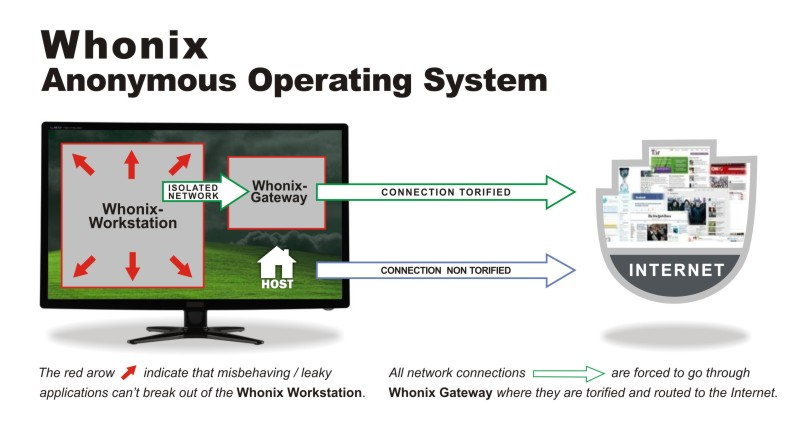

_“It’s only funny until someone loses an identity”_

But we don't so often consider threat to the coding operation itself.
We think oftern about the security of our applications, but not so often about the security of ourselves. The ability to keep coding is essential to your project - more important than its present features.

One persons hero is another persons terrorist. The

This post is not here to at all judge the ethics of a specific befaviour, but to ... the right of freedom to code. Freedom software

We and others subscribe to the ideals of the FSF, but a natural consequence of freedom is that some forms of code become hunted. We operate under such a model, and so offer here a model for survival under suppression.

We are seeking with the interblock project to create a tool that makes suppression resistance easy, and hopefully leads on to being supression proof, but to get there we have to practical, and use the methods available to us at the present technology level.

Things you migth want to be protected from:

- greed
- fights that you can't deal with right now
- reputational harm
- project reputational harm
- patent law
- government
- tax
- piracy
- unpopularity
- discimination

the concept of the zero liability company
only the code matters

[Using vscode](https://code.visualstudio.com/docs/remote/ssh)

what we left out:

- collaboration
- funding

---

Our model is based on a mythical project operator, called Command, that represents the virtualized interests... Command is the identity to be protected above all else.
Then there are two types of identity we operate under - transient, and stable.

Why:

1. For Growth: The reason that we want to be anonymous is that Command needs to be a black box, and as soon as people are associated with her, Command will be perceived with bias, which will limit growth.

- Vacant Throne projection with one or two, or several thousand people
- Founders can be themselves in service of the dreamcatcher, without comprising Command, or themselves and their financial positions

1. For Safety: We’d like to not get sued. This is time wasting but also costly, and unresolved court cases will stunt growth

- Reasonable Doubt: plausible deniability to slow down legal action.
- Sued for IP infringement from companies past, or companies in parallel as yet unknown
- Sued by securities commission for selling unregistered securities
- We do not want to pass on patent rights in case we want to claim them later

1. For Wealth: We’d like to not pay any tax or be otherwise stolen from, to redirect all earnings into growth, whilst claiming irrefutable attribution much later, without being attacked while we are young

1. For Resilience: After being completely burned being able to reboot the project in a matter of days with only the core CMD keys is essential. We should be able to do this in the face of censorship, intrusion, or hardware faults

Threat vectors:

- DMCA takedown
- Patent infringement
- Tax Collectors
- Securities commission

Release checklist:

1. Both passed an operational audit
1. Check every code file for restricted information

Checklist:

1. Not possible to be editing a codebase, then git push as another identity
1. Not possible to login as a cloud identity without using tor

Operating procedures under level 1: Rehearsal
Traceable items needed:
Burner credit card
Burner cell phone number
Bare metal machine with trusted environment installed
Cloud services used:
Github private repos
Protonmail
Google docs
Miro whiteboards
AWS
Protected anonymous asset:
Blockchain codebase
Dreamcatcher codebase
Dreamcatcher Command identities

Controlling material kept on:
Keepass
GPG keys per identity
Activities
Software Development
Command strategy
Infrastructure operation
Knowledge restrictions:
Forbidden:
IP address




Procedure:

1. Ensure bare metal OS is free from any credentials related to any services or compromise, preferably with reinstall
1. Install base OS software:
   1. virtualbox, keepass, putty, vscode, torbrowser
1. Create name for identitiy, and create protonmail and github accounts
   1. Use TOR to access namegen
   1. If creating aws account, use burner credit card
   1. If need sms number for protonmail, use burner number in burner phone device
   1. Github captcha may require about:config in the Firefox address bar and find security.csp.enable and set it to false, and or use the audio captcha at signin
1. Install whonix workstation cli version from https://www.whonix.org/wiki/VirtualBox/CLI
   1. Add a second host only adapter to the workstation vm
1. Install software on whonix workstation:
   1. sudo apt install git openssh-server unzip oathtool
1. Edit file: /etc/whonix_firewall.d/50_user.conf by adding the line: EXTERNAL_OPEN_PORTS+=" 22 "
1. Change the base user password
1. Add following lines to /etc/network/interfaces.d/30_non-qubes-whonix
   ```auto eth1
   iface eth1 inet static
       address 192.168.56.101
       netmask 255.255.255.0
   ```
1. Create user account with same name as the fake identity
1. Follow instructions to set up ssh based editing in vscode: https://code.visualstudio.com/docs/remote/ssh-tutorial
1. Set up node with this command:
   ````export SHELL=bash
   curl -fsSL https://github.com/Schniz/fnm/raw/master/.ci/install.sh | bash```
   ````
1. Create ssh key and add to github
1. Create gpg key for signing commits, and add to github
   1. gpg --full-generate-key --expert (then choose ECC and ECC, then curve 25519, as this makes shorter signatures)
   1. Config git using https://docs.github.com/en/github/authenticating-to-github/managing-commit-signature-verification
   1. git config --global commit.gpgsign true
1. Save the gpg private key and ssh private key in string fields in keepass
   1. gpg --export-secret-key --armor
   1. cat ~/.ssh/id_rsa
1. Set up 2FA on github and install oathtool:

```
   sudo apt install oathtool
   oathtool -b --totp (code from github)
```

Operational rules:

1. Only develop using identity accounts - no dev on the “root” or “user” accounts
1. Set an offensive color theme on torbrowser, so it is immediately clear when it is in use. Try not to use regular browser as this can lead to correlation with you IP and identity
1. Always sign everything, to prevent fraud

Goals

1. Recreate any identity, and prove previous contribution, with just the keepass db
1. Not possible to accidentally attempt to push with another identities credentials
1. Tor gateway shutdown results in no possible pushes to github
1. Be more resistant to error than a vpn
1. Friendly developer experience
1. Rapidly reprovision development environment

## Funding

How can your project receive funding, and maintain anonymity ?

## Bastions

Techniques
The key to anonymity is looking the same as a whole lot of other people. To that end, broadcasting as much information as you can, and following a rigorous set of protocols makes you look the same as anyone else following the plan. We begin by broadcasting our methods to a public blog platform dev.to in order to plausibly say where our info came from

This is all part of our drive towards creating [zero liability companies](dev.to link), which thru transparency and the higher hosting context of public blockchains, can have higher trust levels, greater thruput, more direct service, at lower costs.

Now ideally all this procedure would be hard baked in to the protocol, but since this does not yet exist, we have to use discipline and technique to achieve similar end goals.

https://github.blog/2020-02-20-2019-transparency-report/

Github allows pulling code anonymously, so rely on publication of your repo url, the clone with collaborators thru tor

## Receiving funds

Set up an android based wallet, with full privacy on. These funds will be managed by the central chain

## Bastions

Bastions are isolated networks of operation. There is no cross over between these networks, and no knowledge inside each one of any others. Any bastion breach should not affect any other in any way. They all draw on a common codebase, from the Core. This allows running each corporate venture on an entirely isolated set of infrastructure.

Bastions allow projects to be built atop a potentially swappable blockchain core. The swappability is important should legality force cessation of any particular blockchain, and also to allow migration to the most suitable blockchain, as they become available

Bastion 0: Core
Bastion 1: CRM
Allowed to use for commercial demonstrations locally
Bastion 2: Commercial demos
Bastion N: any endeavours that need isolation

Each bastion must have completely separate identity and infrastructure to the others, and have no contact. Code sharing must be done offline. Only danger is going to anon github urls while logged in to github, which only matters if github gets breached, and should be covered by publicizing the urls.

Ezzo card can give credit cards for bitcoin: https://ezzocard.com/how-to-pay

https://ssd.eff.org/en/module/your-security-plan

Keep the infrastructure hidden - the worst thing that could happen is your site is offline - this is a loss of a potential user, supporter, contributor, or investor. [Uptime under duress](link to dev.to article) is hard

No bastion identities can come in contact with any others. If they need to share code it needs to be via offline means. Leakage from one browsing anothers github repos while logged in is only damaging if github is breached. Always protect the infrastructure.

### Ensuring code equality

Leaks from handwriting - use a diagramming tool like mermaid

# Found a typo?

If you've found a typo, a sentence that could be improved or anything else that should be updated on this blog post, you can access it through a git repository and make a pull request. Instead of posting a comment, please go directly to <REPO URL> and open a new pull request with your changes.

```
-----BEGIN PGP SIGNATURE-----

iNUEABYKAH0WIQSW5v+GQnhyZPP31NRrIU8mdTPWvwUCX2u6518UgAAAAAAuAChp
c3N1ZXItZnByQG5vdGF0aW9ucy5vcGVucGdwLmZpZnRoaG9yc2VtYW4ubmV0OTZF
NkZGODY0Mjc4NzI2NEYzRjdENEQ0NkIyMTRGMjY3NTMzRDZCRgAKCRBrIU8mdTPW
v/JzAP9WO+PZafipDGnI0S1wkGL9Orp7DB9+HjzeDOSb0IbWlwEA9/ZGTOhS3h2Q
Ec9RK2D4zer763O2tAxlDVHaun9mnAM==ApJj
-----END PGP SIGNATURE-----
```
