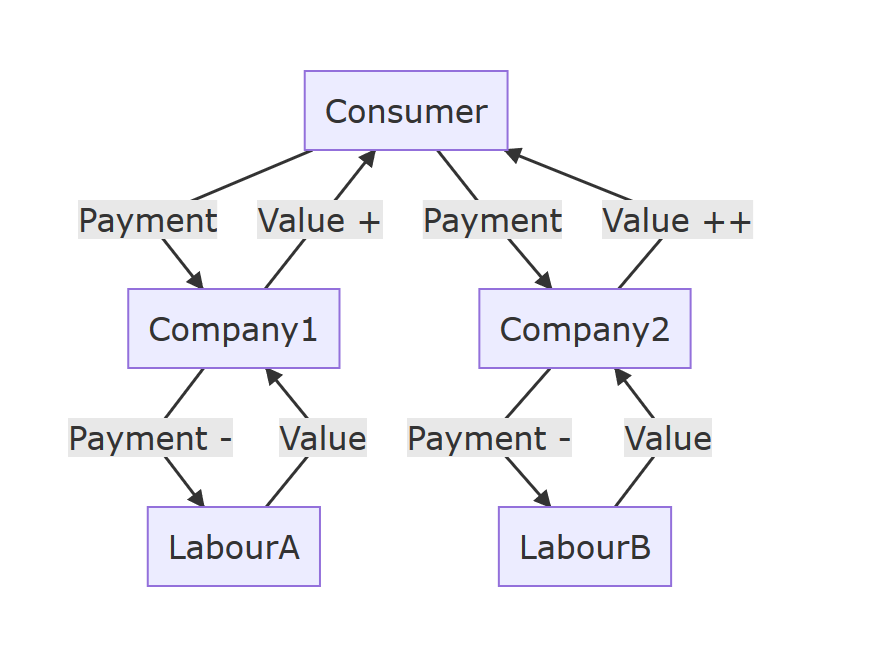

When was it first invented

But the only truly zero liability company is a fully anonymous one.

Building customer trust

The only way to protect the privacy of your customers is to ensure they remain
anoymous.

Switching cost for customers is high, so they will tolerate erosion of value
before switching. Also company 1 and the livelihoods of all their staff are
destroyed by a mass switch, when perhaps the majority of the company did good
work. Then the process repeats again for company 2.

We propose a means by which there is really only one company, and the members
cooperate at whim, and the consumers pay down whichever paths suit them best.

### Outsourcing your identity management requirements.

In such an ecosystem, the dangerous job of correlating identities need only be
managed by a handful of services.

### Exceeding quality of registered companies

Companies do bad things all the time. Clearly being registered is no guarantee
of good behaviour. With zero liability, the responsibily shifts onto the
community to maintain opinion... This correlates with a shift in social mob
justice of suspected bad actors.

Complete anonymity and business models that still work (hopefully!) even tho buy
side and sell side do not know who each other are.

Making a functioning revenue stream when there is no force available - how to
make money from open source software.

Transparency of companies is somewhat like how on a unix system, the operating
system is largely readable by all users, but only writable by a trusted few. It
helps the users to know whats going on.

We only care about the work generated. Work is hard, and full of thorns as the
level of detail increases. Being zero liability and anonymous frees people to
focus solely on the work, and frees consumers to look only at the value of that
work to them, independent of any other forces that can alter perception away
from cold purity of value. It is then up to the producer to choose to declare
what they have done - this is optional, whereas under the current systems it is
required, and criminally punished.

Moreover, we have implemented ways in which people can partially declare
properties about themselves and their work rather than a full destruction of
privacy. For example you can declare yourself a tax resident of x country for
the projects you contributed there, and you can pay tax to that country, but you
need not assosciate your name with it.

The bringers of novel knowledge are often unwelcomed, some violently so
(references). For this reason, the Dreamcatcher network is designed such that
any contributors of work or funds are free to stay anonymous, and at their wish
only reveal as much as they wish. They can also release graduated information
rather than all or nothing. Indeed consumers within the network also can operate
this way, and share any portion of their consumption data on the network

## Operating Activities

1. Real life promotion (conferences, videos, friends)
1. Online Promotion (forums, emails, blogs)
1. Code commits
1. Issue posting
1. TESTING Amazon deployments using serverless.com tooling
1. PRODUCTION Amazon deployments using serverless.com tooling

the concept of the zero liability company only the code matters
